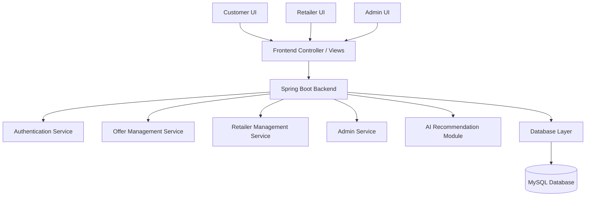

# System Architecture for LocalMart AI
## Project Name: LocalMart AI – Smart Local Shopping & Offer Discovery Platform

## 1. Overview
LocalMart AI is a smart web-based platform that helps customers discover local shopping offers, discounts, and nearby stores in an efficient and personalized manner. The system is designed as a modular, scalable, and secure web application that connects three major user groups:

- Customers who search for offers and promotions
- Retailers who publish and manage local deals
- Administrators who oversee platform operations and content

The architecture is structured to separate concerns clearly so that frontend experience, backend services, authentication, data management, and future AI-based recommendation services can evolve independently.

---

## 2. Architectural Goal
The architecture of LocalMart AI is designed to achieve the following goals:

- Provide a responsive and user-friendly frontend experience
- Ensure secure authentication and role-based access control
- Support efficient storage and retrieval of users, offers, and retailer data
- Allow future integration of AI-based recommendation features
- Make the system easy to deploy, maintain, and scale

---

## 3. High-Level Architecture
The system follows a layered architecture with the following main layers:

1. Presentation Layer
   - Responsible for user interaction through web pages and UI components

2. Application Layer
   - Handles business logic, request processing, validation, and service orchestration

3. Data Layer
   - Stores and retrieves data such as users, offers, reviews, and admin records

4. Security Layer
   - Manages authentication, authorization, and protected access to resources

5. Intelligence Layer (Future/Planned)
   - Provides AI-based offer recommendations and smart shopping insights

A simplified architecture view is shown below:



---

## 4. Frontend Architecture
### 4.1 Purpose
The frontend is the user-facing layer of the application. It allows customers, retailers, and administrators to interact with the system through a browser-based interface.

### 4.2 Responsibilities
The frontend is responsible for:
- Displaying the landing page and home screen
- Providing login and registration forms
- Showing offers, categories, stores, and promotions
- Allowing retailers to add or update their offers
- Allowing administrators to manage users and content
- Sending requests to the backend and handling responses

### 4.3 Frontend Technologies
The planned frontend stack includes:
- HTML5 for page structure
- CSS3 for styling
- Bootstrap 5 for responsive design
- JavaScript for dynamic behavior
- Thymeleaf templates for server-rendered UI in the initial version

### 4.4 Frontend Design Approach
The frontend should be designed as:
- Responsive for mobile and desktop devices
- Simple and user-friendly for non-technical users
- Role-based so that different users see different dashboards and actions

### 4.5 Frontend Modules
- Customer interface
- Retailer dashboard
- Admin control panel
- Public landing page and offer listing pages

---

## 5. Backend Architecture
### 5.1 Purpose
The backend is the core application layer that processes requests, executes business logic, interacts with the database, and returns responses to the frontend.

### 5.2 Responsibilities
The backend handles:
- User authentication and authorization
- Offer creation, update, deletion, and retrieval
- Retailer account and offer management
- Admin operations such as moderation and control
- Integration with the AI module for recommendations
- Validation of input data and business rules

### 5.3 Backend Technologies
The proposed backend stack is:
- Java 17
- Spring Boot 3
- Spring Security
- Spring Data JPA
- Hibernate ORM
- REST APIs / MVC controllers
- JWT authentication

### 5.4 Backend Modular Structure
The backend should be organized into separate modules or packages such as:
- Auth module
- User module
- Offer module
- Retailer module
- Admin module
- AI service module
- Common utilities and configuration

### 5.5 Backend Design Principles
The backend should follow:
- Separation of concerns
- Layered architecture
- Dependency injection
- Stateless authentication with JWT
- Clean and maintainable service-based design

---

## 6. Database Architecture
### 6.1 Purpose
The database stores all application data required for operation, including user accounts, offers, retailer accounts, roles, and system metadata.

### 6.2 Recommended Database
The system is planned to use:
- MySQL as the primary relational database
- H2 only for local development/testing if needed

### 6.3 Core Data Entities
The database should include entities such as:
- Users
- Roles
- Retailers
- Offers
- Categories
- Reviews/ratings (future scope)
- Admin records
- Verification tokens

### 6.4 Data Relationships
Typical relationships include:
- One user can have one role
- One retailer can publish many offers
- One offer belongs to one category
- One offer belongs to one retailer
- Admins manage content and user access

### 6.5 Database Design Considerations
The database design should ensure:
- Normalized structure for maintainability
- Proper indexes for faster offer search
- Secure storage of credentials and tokens
- Referential integrity between related entities

---

## 7. Authentication and Security Architecture
### 7.1 Purpose
Security is a critical part of the system because the platform handles user accounts, retailer accounts, and admin access.

### 7.2 Authentication Mechanism
The system uses:
- JWT (JSON Web Token) authentication
- Secure login and registration flow
- Password hashing using secure password encoding

### 7.3 Authorization Model
The system supports role-based access control:
- Customer: can browse offers and interact with public features
- Retailer: can publish and manage offers
- Admin: can manage users, offers, and platform content

### 7.4 Security Features
The architecture should include:
- Password encryption
- Token-based session handling
- Protected API endpoints
- Role-based route access
- Secure communication using HTTPS in deployment
- Input validation and exception handling

### 7.5 Security Layers
Security should be applied at multiple layers:
- Frontend validation
- Backend API validation
- Authentication filter layer
- Authorization checks before business logic execution

---

## 8. AI Module Architecture
### 8.1 Purpose
The AI module is designed to make LocalMart AI smarter by recommending relevant offers to users based on preferences, user behavior, location, and shopping patterns.

### 8.2 Role of the AI Module
The AI component can provide:
- Personalized offer recommendations
- Category-based suggestions
- Customer preference analysis
- Smart discovery of relevant local deals

### 8.3 AI Module Placement
The AI module is planned as a separate service layer that integrates with the backend. It should not directly depend on the UI layer.

### 8.4 AI Module Responsibilities
- Analyze user behavior and offer data
- Generate suggestion results
- Return recommended offers to the frontend or application service layer

### 8.5 AI Module Design Approach
In the initial version, the AI module may be simple rule-based or lightweight recommendation logic. In future versions, it can evolve into a more advanced machine learning-based engine.

---

## 9. Retailer Module Architecture
### 9.1 Purpose
The retailer module enables businesses to manage their promotional content on the platform.

### 9.2 Responsibilities
Retailers should be able to:
- Register as a retailer
- Create offers and discounts
- Update or remove offers
- View offer analytics and activity
- Manage their store profile and offer history

### 9.3 Retailer Module Features
- Retailer dashboard
- Offer submission form
- Offer status tracking
- Store information management
- Approval workflow for submitted offers (if implemented)

### 9.4 Interaction with Other Modules
The retailer module interacts with:
- Authentication module for login and authorization
- Offer management service for publishing offers
- Admin module for moderation and approval

---

## 10. Customer Module Architecture
### 10.1 Purpose
The customer module is designed for end users who want to discover local offers easily.

### 10.2 Responsibilities
Customers should be able to:
- Register and sign in
- Browse offers
- Search by category or locality
- View offer details
- Save or favorite offers (future scope)
- Receive tailored suggestions from the AI engine

### 10.3 Customer Experience Design
The customer module should provide:
- A clean homepage
- Offer cards and search filters
- Store and discount information
- A simple and fast browsing experience

### 10.4 Interaction with Other Modules
The customer module interacts with:
- Authentication service for secure access
- Offer service for retrieving promotions
- AI service for personalized recommendations

---

## 11. Admin Module Architecture
### 11.1 Purpose
The admin module provides control over the platform’s content, users, and overall operations.

### 11.2 Responsibilities
Administrators should be able to:
- Manage users and roles
- Approve or reject retailer offers
- Remove suspicious or invalid content
- Monitor platform activity
- Update system configurations and content policies

### 11.3 Admin Interface Features
- Dashboard overview
- User management panel
- Offer management panel
- Content moderation tools
- Reports and logs (future scope)

### 11.4 Interaction with Other Modules
The admin module interacts with:
- Authentication for secure access
- User module for account management
- Offer module for moderation
- Retailer module for review and approval

---

## 12. Request Flow Architecture
### 12.1 Typical Customer Request Flow
1. A customer opens the application in the browser.
2. The frontend renders the home page or login page.
3. The user sends a request to the backend API.
4. The backend validates the request and checks authentication if required.
5. The backend invokes the appropriate service layer.
6. The service layer accesses the database if needed.
7. The data is returned to the frontend.
8. The frontend displays the response to the user.

### 12.2 Typical Retailer Offer Submission Flow
1. Retailer logs in using credentials.
2. Retailer opens the offer creation form.
3. The frontend sends the offer data to the backend.
4. Backend validates the input and authorizes the retailer role.
5. The offer service stores the offer in the database.
6. Admin review may be triggered if moderation is enabled.
7. The offer becomes visible to customers after approval.

### 12.3 Typical Admin Flow
1. Admin logs in.
2. Admin accesses the admin dashboard.
3. Admin requests user or offer management actions.
4. Backend validates admin authorization.
5. Database is updated accordingly.
6. Frontend displays the updated state.

---

## 13. Deployment Architecture
### 13.1 Deployment Model
The application can be deployed as a web application on a cloud server or local server environment.

### 13.2 Recommended Deployment Components
- Application Server: Spring Boot application hosted on a server
- Database Server: MySQL database hosted locally or in the cloud
- Web Server / Reverse Proxy: Nginx or similar may be used for production deployment
- Domain and SSL: HTTPS for secure access

### 13.3 Production Deployment Architecture
A typical production deployment flow may include:
- User browser requests the application over HTTPS
- Nginx or reverse proxy forwards traffic to the Spring Boot application
- Spring Boot backend processes business logic and API calls
- MySQL stores persistent data
- Optional AI services are integrated through backend modules

### 13.4 Deployment Considerations
The deployment architecture should support:
- Environment-based configuration
- Secure secret management
- Logging and monitoring
- Backup and recovery of database data
- Scalability for increased traffic

---

## 14. Folder Structure (Conceptual)
A well-structured project folder can be organized as follows:

```text
localmart-ai/
├── src/
│   ├── main/
│   │   ├── java/
│   │   │   └── com/localmart/
│   │   │       ├── auth/
│   │   │       ├── user/
│   │   │       ├── retailer/
│   │   │       ├── offer/
│   │   │       ├── admin/
│   │   │       ├── ai/
│   │   │       ├── config/
│   │   │       ├── security/
│   │   │       └── web/
│   │   └── resources/
│   │       ├── templates/
│   │       ├── static/
│   │       └── application.properties
│   └── test/
├── docs/
├── README.md
├── pom.xml
└── .gitignore
```

---

## 15. Why This Architecture is Suitable
This architecture is suitable for the project because it provides:
- Clear separation of frontend and backend responsibilities
- Strong support for security and role-based access
- Easy extension for future AI and analytics features
- Good structure for academic demonstration and practical implementation
- A scalable foundation for future enterprise-level enhancement

---

## 16. Conclusion
The system architecture of LocalMart AI is designed as a layered, secure, and modular web application. It supports three major user roles—customers, retailers, and administrators—while providing a strong foundation for future AI-powered personalization. The architecture ensures maintainability, scalability, and future growth, making it suitable for a final-year MCA project.
